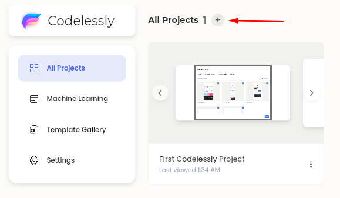
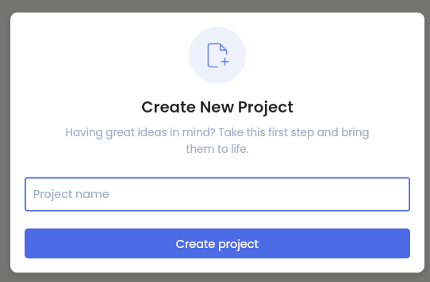
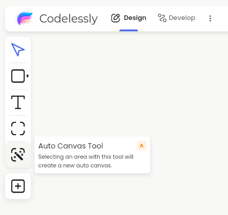

# 🎉 Thank you for your purchase!

**Please Note:** This page contains important setup information. Please bookmark this page for future reference ([https://docs.codelessly.com](https://docs.codelessly.com)). A purchase confirmation and link to this page will be sent to your email.

### **Getting Started**

Congratulations on your purchase! We're thrilled to have you on this journey with us.

First, let's get you access to the Codelessly Editor.&#x20;

**New Account**: If you don't have a Codelessly account yet, please visit [https://app.codelessly.com](https://app.codelessly.com/) to create an account. Remember to signup using your purchase email as the license is linked to your purchase email. Please reach out to support if you would like to use a different email to create an account.

**Existing Account:** If you have already created a Codelessly account, your account will be automatically upgraded as long as the purchase email is the same as your account email. Please reach out to support if you purchased using a different email and your account has not been upgraded.

**Codelessly Editor:** [https://app.codelessly.com](https://app.codelessly.com)

### **1. Create a New Project**

Press the "+" button to create a new project.

<figure><figcaption></figcaption></figure>

Give your project a name.

<figure><figcaption></figcaption></figure>

### 2. Create a New Canvas

This is the tools panel. You can hover over each tool to see their name and description. Select the canvas tools and drag in the editor box area to create a new canvas.

<figure><figcaption></figcaption></figure>

There are two types of canvases, Freeform Canvas and AutoCanvas.

**Freeform Canvas**  - The traditional design canvas where items are absolute positioned by default.

**AutoCanvas**  - A familiar "drag and drop" canvas with rows and columns and responsiveness support by default.

It's recommended to start with an AutoCanvas as it is designed to be beginner friendly. If you have a complex layout that mixes absolute positioned and layout widgets, start with a Freeform canvas instead.

### 3. Build Your First Layout with AutoCanvas

AutoCanvas is as simple as drag and drop. Building layouts has never been easier!

<figure><figcaption></figcaption></figure>

To start, drag a widget into the AutoCanvas where it says "Drop a widget here"

<figure><figcaption></figcaption></figure>

**Column** - Create a column by dragging to the top or bottom edge.

<figure><figcaption></figcaption></figure>

**Row** - Create a row by dragging to the left or right edge.

<figure><figcaption></figcaption></figure>

### 4. Build Your First Layout in Freeform Mode

By default, the editor is in Freeform mode. Hold down `Ctrl / Cmd` when dragging one widget next to the edge of another widget to build layouts in Freeform mode.

<figure><figcaption></figcaption></figure>


Ctrl / Cmd toggles between Freeform and Layout mode.


Once you have a layout, Codelessly will intuitively switch between Freeform and layout mode. You can drag widgets into existing layouts without holding down the button.

<figure><figcaption></figcaption></figure>

The same concept applies in reverse. Hold down `Ctrl / Cmd` while dragging over an existing layout to position widgets in Freeform mode.&#x20;

Here, once `Ctrl / Cmd` is pressed, the editor switches to Freeform mode and the Layout grid disappears.

<figure><figcaption></figcaption></figure>

### Quick Recap

Pressing `Ctrl / Cmd` to toggle between Freeform and Layout mode is key to building layouts in the Codelessly Editor.

**Scenarios**

* **Outside of canvases** - editor is Freeform by default. Hold down `Ctrl / Cmd` to create layouts.
* **Inside a Freeform Canvas** - Hold down `Ctrl / Cmd` to create layouts.
* **Inside of an AutoCanvas** - drag and drop. Hold down `Ctrl / Cmd` to absolute position widgets.

