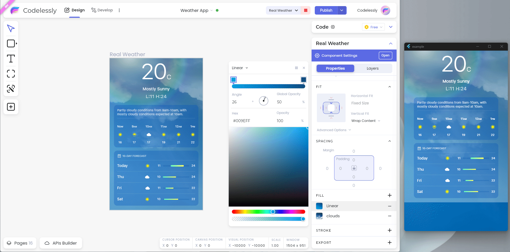

# 3-Minute Quick Start

## Quick Preview

Quick preview feature lets you publish and preview a canvas in a single click. The layouts get published instantly and sync with any changes you make in the canvas. This is useful to test and debug the layouts.

Select the canvas you wish to publish and press the _Quick Preview_ button in the app bar.

<figure><figcaption><p>Quick Preview Button</p></figcaption></figure>

This will upload the canvas and open up a dialog with all the necessary information you need to preview the canvas.

<figure><figcaption><p>Quick Preview Dialog</p></figcaption></figure>

You have two options to preview the uploaded canvas:

### Loading preview in Codelessly's mobile app

Tap on the _"View a preview" button_.

<figure><figcaption><p>"View a preview" Button</p></figcaption></figure>

Scan the QR code from the mobile app's scanner to instantly preview the canvas. Alternatively, you can input the _Preview Key Code_ to load the preview.

<figure><figcaption><p>Preview Key Code Field</p></figcaption></figure>

This is how the preview looks in the mobile app.

<figure><figcaption><p>Canvas Preview in Codelessly's Mobile App</p></figcaption></figure>

### **Embedding the preview in your app**

Copy-paste the provided code to embed the canvas in your app. `CodelesslyWidget`, being a widget, can be embedded anywhere in the widget tree.

## CodelesslyWidget

`CodelesslyWidget` is a widget that renders the layout by utilizing the data of the canvas you publish from the editor. It takes in the following parameters:

1. `layoutID`: ID of the published canvas.
2. `isPreview`: Whether the layout is in preview or production mode. Preview mode is meant for debugging the layout and syncs with the changes made in the editor. Widgets in production mode do not sync and are only updated when explicitly published using the _Publish_ button.
3. `config`: It takes an instance of `CodelesslyConfig` that holds the information required to fetch the canvas data from the server. `authToken` is required while other parameters are optional.

## Initializing SDK

Before you can use `CodelesslyWidget`, you need to initialize the SDK. To do that, simply call the `initializeSDK` method before you render any `CodelesslyWidget`. Ideally, call it in the `main` method.

```dart
void main() {
  Codelessly.initializeSDK();
  
  runApp(MyApp());
}
```

`initializeSDK` takes in several parameters to provide complete flexibility. For example, you can declare `config` in this method to make it the default configuration of all `CodelesslyWidget`s, unless overriden.

```dart
Codelessly.initializeSDK(
  config: const CodelesslyConfig(
    authToken: authToken,
  ),
);
```

Similarly, you can declare `data` and `functions` to make them globally accessible.

## Example

Here's an example of how you can embed a canvas in your app using Codelessly's SDK:

```dart
import 'package:codelessly_sdk/codelessly_sdk.dart';
import 'package:flutter/material.dart';

void main() {
  WidgetsFlutterBinding.ensureInitialized();
  
  // Initialize SDK.
  Codelessly.initializeSDK(
    config: const CodelesslyConfig(
      authToken: 'LDliZlRlTS5EOTAsUzsrR3VfK0coN2sqbDI9OkVMazN4YXUv',
    ),
  );

  runApp(const MyApp());
}

class MyApp extends StatelessWidget {
  const MyApp({Key? key}) : super(key: key);

  @override
  Widget build(BuildContext context) {
    return MaterialApp(
      title: 'Codelessly SDK Example',
      debugShowCheckedModeBanner: false,
      home: SafeArea(
        // CodelesslyWidget in preview mode.
        child: CodelesslyWidget(
          isPreview: true,
          layoutID: '0QsQaSzQ0A4RIzKKuN8Y',
        ),
      ),
    );
  }
}
```

The app should look like this:

<figure><figcaption><p>Canvas embedded in app.</p></figcaption></figure>

Since the widget is in preview mode, whenever we make a change to the canvas in the editor, it's instantly reflected in the widget as well.

<figure><figcaption><p>Live Updates</p></figcaption></figure>

## Publishing Layouts

After you have tested your layouts and are ready to make it available to your users, you can publish the layouts by pressing the _Publish_ button.

<figure><figcaption><p>Publish Button</p></figcaption></figure>


Once a canvas is published, it is pushed to the users' devices and remains accessible unless deleted explicitly.


