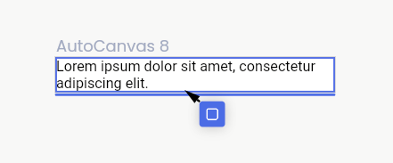
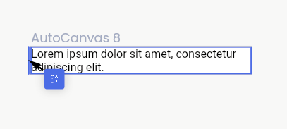

# Creating Your First Layout

### What you'll learn:

1. The difference between freeform layouts and auto layouts.
2. Ways to create rows and columns.
3. Creating an auto canvas & freeform canvas.

### Creating Rows & Columns

There are two ways to create Rows & Columns.

#### CTRL/CMD key

By holding down the CTRL/CMD key while dragging a node over another node, you will see an insertion UI that gives you feedback on what you want to do. For nodes that don't support nodes being inserted inside of them, you will only see edge-highlighting with an indicator on what will happen when you release the cursor.

If you release your cursor while hovering near the **bottom or top edges** of a node, both nodes will be wrapped inside of a newly created **Column**.

If you release your cursor while hovering near the **left or right edges** of a node, both nodes will be wrapped inside of a newly created **Row**.

<figure><figcaption></figcaption></figure>

If you hold down the CTRL/CMD key while dragging a node inside of another node that can support children inside of it, you will see the **Alignment Insertion UI**.

<figure><figcaption></figcaption></figure>

#### Smart Suggestions

By positioning the nodes in the **layout of a Row or Column**, you will see a _Smart Suggestion_ to convert your selection into one or the other.

<figure><figcaption></figcaption></figure>

### Freeform vs Auto

Codelessly supports two positioning systems, Freeform and Auto. Switching between them is very easy and intuitive, just hold down Ctrl / Cmd while dragging a widget! The layout system will automatically switch between Freeform and Auto.

#### Freeform

A freeform layout is one in which all elements use exact pixel coordinates relative to their parent elements to place themselves.

If you're a familiar with common design tools such as Figma, Freeform is the positioning system most design tools use.

Freeform is excellent for design but is not responsive. For designs to resize to multiple screen sizes, you'll need to use Auto layout.

#### Auto

With Auto layouts, your screens are built with **Rows** and **Columns**. Each element is placed in some structured fashion such that the **Rows** and **Columns** control the positioning and sizing of each element. On top of that, each element might size itself with its own rules. We'll learn more about how elements can size themselves differently in the next sections.

### Creating an Auto Canvas

This is the tools panel. You can hover over each tool to see their name and description. Select the canvas tools and drag in the editor box area to create a new canvas.

<figure><figcaption></figcaption></figure>

### Build Your First Layout with Auto Canvas

AutoCanvas is as simple as drag and drop. You will not need to hold down your CTRL/CMD key since items you drag into an Auto Canvas will go into Auto Layout mode by default.

Building layouts has never been easier!

<figure><figcaption></figcaption></figure>

To start, drag a widget into the AutoCanvas where it says "Drop a widget here"

<figure><figcaption></figcaption></figure>

**Column** - Create a column by dragging to the top or bottom edge.

<figure><figcaption></figcaption></figure>

**Row** - Create a row by dragging to the left or right edge.

<figure><figcaption></figcaption></figure>

### What are canvases?

You can think of canvases as the screen that your layouts will be displayed inside of. In other words, you can think of it as the dimensions of the display that your app will live inside. Canvases also hold additional functionality:&#x20;

* They scope your data & variables. Read me about those in the upcoming sections.
* You can publish your canvas through the **Codelessly Cloud UI** service.
* You can preview your layout directly in the editor as if it were published with the ability to preview how your layout reacts to different device shapes.
* Support for Flutter's built-in App Bars, Navigation Bars, and Floating Action Buttons (FABs) as direct Scaffold properties.

#### What's the difference between a Freeform Canvas and an Auto Canvas?

A freeform canvas  is a blank canvas that lets you position nodes with **absolute pixel coordinates** anywhere inside. They are **not** responsive and your layouts will not resize, reposition, adapt, or respond to any different size the canvas is set to. They do, however, respond well to the **AutoScale responsiveness mode**. Read more about the responsive modes in the upcoming sections.

An auto canvas , on the other hand, is a **Column** by default. Layouts you build will immediately go into **Auto Layout mode** and will attempt to be as responsive as possible, as if you were holding down your CMD/CTRL key when dragging items inside.

It's recommended to start with an **AutoCanvas** as it is designed to be beginner friendly. If you have a complex layout that mixes absolute positioned and layout widgets, start with a Freeform canvas instead.

It eventually boils down to your use-case, and our layout engine fully supports mixing both systems inside of each other.
