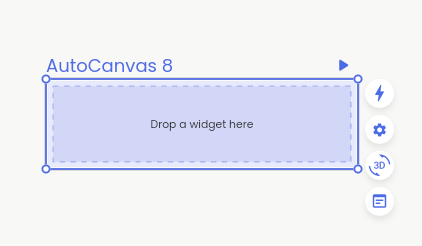

# Creating Your First Layout

### What you'll learn:

1. The difference between freeform layouts and auto layouts.
2. Ways to create rows and columns.
3. Creating an auto canvas & freeform canvas.

### The difference between freeform layouts and auto layouts.

At Codelessly, we refuse to limit your creations in any way. As such, we have two primary positioning systems, Freeform and Auto.

#### Freeform

A freeform layout is one in which all elements use exact pixel coordinates relative to their parent elements to place themselves.

If you're a familiar with Figma, Freeform is what you'll normally be used to.

Freeform is excellent for designers in general, but it fails when it comes to responsve UI. If you wish for the mobile-shaped screen you built to be used in any other screen resolution like desktop, the layout will not adapt properly.&#x20;

#### Auto

With auto layouts, your screens are built out of combinations of **Rows** and **Columns**. Each element is placed in some structured fashion such that the **Rows** and **Columns** control the positioning and sizing of each element. On top of that, each element might size itself different. We'll learn more about how elements can size themselves differently in the next sections.

### Creating Rows & Columns

There are two ways to create Rows & Columns.

#### CTRL/CMD key

By holding down the CTRL/CMD key while dragging a node over another node, you will see an insertion UI that gives you feedback on what you want to do. For nodes that don't support nodes being inserted inside of them, you will only see edge-highlighting with an indicator on what will happen when you release the cursor.

If you release your cursor while hovering near the bottom or top edges of a node, both nodes will be wrapped inside of a newly created Column.

If you release your cursor while hovering near the left or right edges of a node, both nodes will be wrapped inside of a newly created Row.

<figure><figcaption>
Holding down the CTRL/CMD key and dragging a node over another node, entering layout mode to create a Row with the two items together.
</figcaption></figure>

If you hold down the CTRL/CMD key while dragging a node inside of a box or node that can support children inside of it, you will see an Alignment Insertion UI.

<figure><figcaption>
Holding down the CTRL/CMD key and dragging a node over another node, entering layout mode to align the dragged node inside the other.
</figcaption></figure>

#### Smart Suggestions

By loosely positioning the nodes in the general flow of a Row or Column, you will see a Smart Suggestion to convert your selection into one or the other.

<figure><figcaption>
Selecting multiple nodes that flow in the direction of a Column shows a Smart Suggestion to convert them as such.
</figcaption></figure>

### What are canvases?

You can think of canvases as the screen that your layouts will be displayed inside. In other words, you can think of it as the dimensions of the display that your app will live inside. Canvases also hold additional functionality, they scope your data & variables, you preview your layout live, you can publish your canvas through the Codelessly Cloud UI service, as well as some additional benefits like supporting App Bars and Navigation Bars.

#### What's the difference between a Freeform Canvas and an Auto Canvas?

A freeform canvas  is a blank canvas that lets you position nodes with absolute pixel coordinates anywhere inside. They are not responsive and your layouts will not resize, reposition, adapt, or respond to any different size the canvas is set to.

An auto canvas , on the other hand, is a Column by default. Layouts you build will immediately go into Auto Layout mode and will attempt to be as responsive as possible.

It's recommended to start with an AutoCanvas as it is designed to be beginner friendly. If you have a complex layout that mixes absolute positioned and layout widgets, start with a Freeform canvas instead.

### Creating an Auto Canvas

This is the tools panel. You can hover over each tool to see their name and description. Select the canvas tools and drag in the editor box area to create a new canvas.

<figure><figcaption></figcaption></figure>

### Build Your First Layout with Auto Canvas

AutoCanvas is as simple as drag and drop. You will not need to hold down your CTRL/CMD key since items you drag into an Auto Canvas will go into Auto Layout mode by default.

Building layouts has never been easier!

<figure><figcaption></figcaption></figure>

To start, drag a widget into the AutoCanvas where it says "Drop a widget here"

<figure><figcaption></figcaption></figure>

**Column** - Create a column by dragging to the top or bottom edge.

<figure><figcaption></figcaption></figure>

**Row** - Create a row by dragging to the left or right edge.

<figure><figcaption></figcaption></figure>
