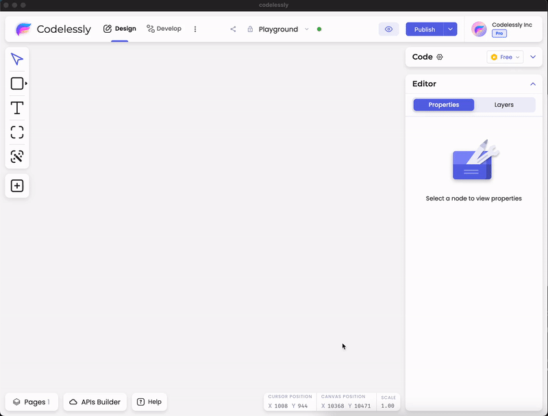

# Using Components

<figure><figcaption>
Components Library
</figcaption></figure>

Codelessly has a wide range of pre-built, high quality and highly customizable components that you can directly use in your layouts to quickly build UIs. These components are available in the components library.

### Components

Here's a list of all the available components.

* Icon
* Button
* TextField
* Checkbox
* Switch
* Radio
* Slider
* App Bar
* Navigation Bar
* Scaffold
* Floating action button
* Divider
* Loading Indicator
* List Tile
* Expansion Tile
* Accordion
* List View
* Page View (Carousel)
* Tab Bar
* Embedded Video
* Embedded Web View
* Progress Bar
* External Component

Click on this `+` button in the tools panel on the left of the editor to open components library.

<figure><figcaption>
How to open components library.
</figcaption></figure>

You can drag & drop any component you want directly to the canvas from components library.

<figure><figcaption>
Drag and drop components
</figcaption></figure>

All these components support full customization of how they look and function. To access component properties, select a component and click on the floating `Settings` button right next to it.

<figure><figcaption>
Accessing component settings
</figcaption></figure>

You can alternatively click on `Open` button in Component Settings banner at the top of the properties panel on the right.

<figure><figcaption></figcaption></figure>

This opens up the component settings panel. This panel contains an interactive preview of the component at the top which provides visual aid while customizing them.

<figure><figcaption>
Button Settings panel
</figcaption></figure>

