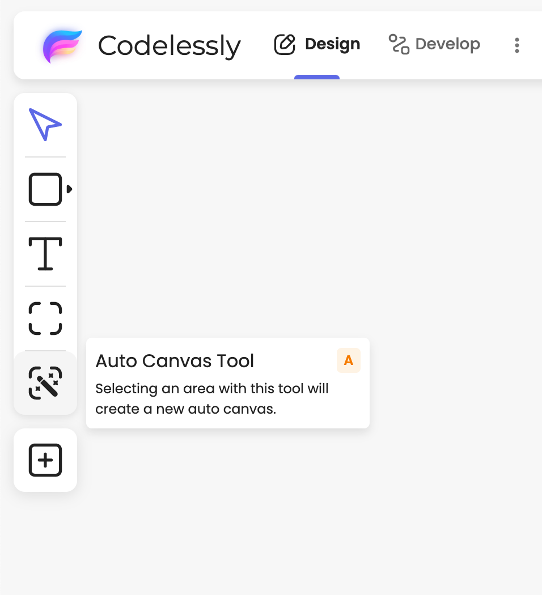

# 🖨️ Publish your design as a website

Codelessly supports publishing your design as a website with a single click. Codelessly's AutoScale technology will automatically resize your designs to fit on different screen sizes.&#x20;

Let's turn your designs into a website!


When you're ready to publish to a custom domain, see our guide on [Custom deployments and publishing](broken-reference)


## Quickstart

After you import or create a design, you'll need to choose a unique URL for your website.

1. Click on the chevron icon  next to the publish button.

<figure><figcaption></figcaption></figure>

2. Click on the `Configure` button under the Website section to configure website publishing.&#x20;

<figure><figcaption></figcaption></figure>

3. This will open the **Publish Settings** dialog with the `Website` tab selected. Under the **Home Page** section, from the dropdown, select a canvas that you want to use as home page for your website. This will be the page that will be displayed when your website is visited.

<figure><figcaption></figcaption></figure>

3. Under the **Publish Site** section, set a custom slug for your website. Use a subdirectory name of your choice. This will be the URL for your website.
4. Click on the **Save & Publish** button to save your configuration. Codelessly will now deploy your website.

<figure><figcaption></figcaption></figure>

5. Congratulations!🎉 Your website is live on the Internet now! Click on the **Open Link** button to view your published website.

<figure><figcaption></figcaption></figure>

## Publishing Updates

Codelessly supports 1-Click publishing. To publish updates, click on the chevron dropdown button and make sure the checkbox in the website section is selected. Hit the Publish button to update your website.

<figure><figcaption></figcaption></figure>

With 1-Click publishing, you can simply press the publish button whenever you want to publish changes!

### Publishing on your own Custom Domain

We support integrating with third-party platforms like [Netlify](https://www.netlify.com/) and [Vercel](https://vercel.com/) and Github for publishing to custom domains. See our [Custom Deployments and Publishing](broken-reference) guide for more info.
